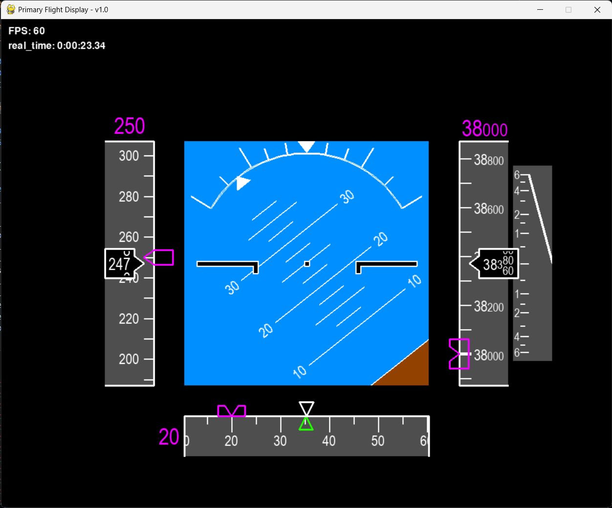

# PrimaryFlightDisplay

A Primary Flight Display (PFD) interface created with Pygame for real-time visualization of aircraft attitude, speed, and altitude. The interface supports two versions tailored for different aircraft characteristics.



## Features

- Real-time display and update of aircraft state parameters
- Smooth animation of flight dynamics
- Customizable screen dimensions and frame rates
- Two versions of the interface with different ranges and units:
  - Standard version for commercial aircraft
  - Alternative version (`little=True` in object instantiation) for drones or small aircrafts

## Getting Started

1. Clone the repository:
    ```bash
    git clone https://github.com/pabloramesc/PrimaryFlightDisplay.git
    ```

2. Open the project folder:
    ```bash
    cd PrimaryFlightDisplay
    ```

3. Install the required packages:
    ```bash
    pip install numpy pygame
    ```

4. Run an example:
    ```bash
    python example.py
    ```

## Usage

Below is an example demonstrating how to use the PFD interface with `AircraftState` and `PrimaryFlightDisplay`:

```python
from pfd import AircraftState, PrimaryFlightDisplay

# Create a PrimaryFlightDisplay object
SCREEN_WIDTH = 1000
SCREEN_HEIGHT = 800
PFD = PrimaryFlightDisplay(
    (SCREEN_WIDTH, SCREEN_HEIGHT),
    masked=True,
    max_fps=60,
    little=False
)

# Create an AircraftState object
state = AircraftState(
    pitch=10.0,             # degrees
    roll=20.0,              # degrees
    airspeed=250.0,         # knots
    airspeed_cmd=250.0,     # knots
    vspeed=1000.0,          # feets per minute
    altitude=30000.0,       # feets
    altitude_cmd=30000.0,   # feets
    heading=180.0,          # degrees
    heading_cmd=180.0,      # degrees
    course=185.0            # degrees
)

# Update the PFD with the current AircraftState
elapsed_time = 10.0  # Simulating 10 seconds of elapsed time
PFD.update(state, elapsed_time)

# Draw the updated PFD display
PFD.draw()

# Render the Pygame display
PFD.render()

```

## License

This project is licensed under the MIT License. See the [LICENSE](LICENSE) file for details.
